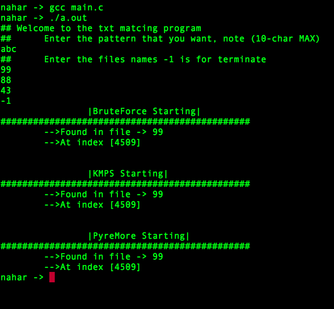

# String-Matching

## Table of Contents

* [About the project](#About the project)
* [How run the program](#How run the program)

## About the project

The project is about Implementation of 3 different String-Matching algorithm and they are:
a) Brute force algorithm.
b) Knuth-Morris-Pratt’s algorithm (KMP).
b) Boyer-Moore's algorithm.
we run the input pattern to every algorithm and compare the performance.

## How run the program
CD TO String-Matching directory and the run the following code
```bash
gcc main.c
```
then
```bash
./a.out
```
## Screenshot
 "screenshot"
